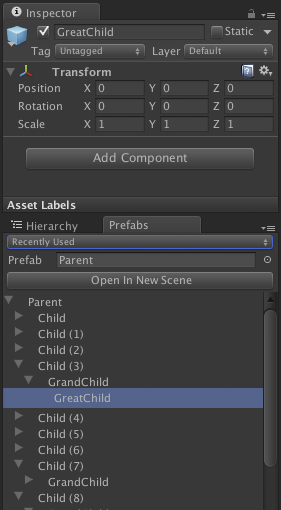

# Prefab Hierarchy Inspector

This is an editor window for Unity3D to facilitate working with Prefabs. I got tired of re-navigating to select various parts of prefabs. And littering my scenes with de-activated prefabs while I work on stuff. This is an experiment to see how this could potentially improve my workflow.

Features:

 * Displays the entire prefab's hierarchy instead of just going one level deep.
 * Automatically opens up the currently selected game object in the Inspector.
 * Remembers your current view of the prefab within the hierarchy.
 * Click 'Open in New Scene' to create a new scene and put the current prefab in it.
 * Maintains a list of recently used prefabs.
 * Arrow keys to navigate the hierarchy.
 * All data is remembered between restarts.

[This is part of the Enemy Hideout Code Archive](http://enemyhideout.com/2016/05/free-code-from-the-hideout/)
